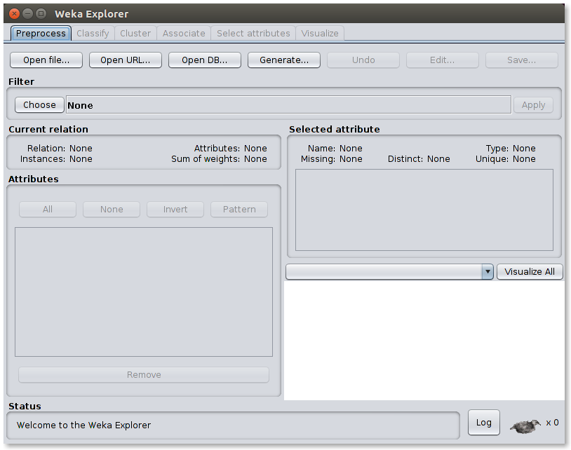
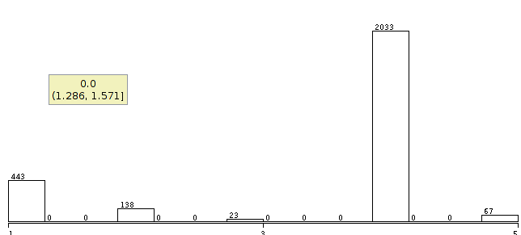

```{r setup, include=FALSE}
knitr::opts_chunk$set(echo = FALSE)
library(ggplot2)
library(zoo)
library(lubridate)
library(stringr)
library(dplyr)
```

## A linguagem R

R é uma linguagem versátil com foco em análise e estátisica de dados. Existe uma comunidade crescente e segundo o TIOBE <http://www.tiobe.com/tiobe-index> R ocupa a décima quarta posição no ranking de linguagens mais utilizadas (Maio de 2017).

## Bibliotecas em R

Há uma certa facilidade em encontrar bibliotecas com os mais variados propositos em R, há uma lista oficial de pacotes incorporados no repositório oficial da linguagem [link](https://cran.r-project.org/web/packages/available_packages_by_name.html). Por ser OpenSource qualquer pessoa pode extender e criar novas bibliotecas.

```R
install.packages("ggplot2")
install.packages("zoo")
install.packages("lubridate")
install.packages("stringr")
install.packages("dyplyr")
```

## Syntax

R possui uma syntax ligeiramente similar a linguagens mais comumente usadas como C e Python.
Nós temos os tipos Números, Carácter, Lógico, Integer.

Também temos os tipos complexos Dataframe, Date, etc.
É posssível manipular dados em uma matriz por exemplo.

```{r, echo = TRUE}
matriz <- matrix(data = 1:15, nrow = 5)
colnames(matriz) <- c("Dia", "Mês", "Ano")
print(matriz)
```

## Carregando arquivo CSV
```{r, echo = TRUE}
# Carregando dataset
dengue_dataset = read.csv("~/Pessoal/tcc/casos-dengue2016.csv",
                          sep = ";")
nrow(dengue_dataset) # Quantas tuplas existem nesse dataset
```

## Slide with R Output
```{r, echo = TRUE}
# Filtrando linhas que possuem data real
data_clean <- dengue_dataset %>%
  filter(str_detect(dt_nascimento, "-"))

com_febre <- dengue_dataset %>%
  filter(str_detect(febre, "1"))

sem_febre <- dengue_dataset %>%
  filter(str_detect(febre, "2"))


# Filtrando as tuplas que possuem o bairro preenchico
com_bairros <- data_clean %>%
  filter(!grepl("^$", no_bairro_residencia))

# Ordenando os bairros pelo número de agrupamento
bairros <- count(com_bairros,
	no_bairro_residencia, sort = TRUE)

# Filtrando os dez primeiros colocados
bairros <- bairros[1:10,]

```
## Plotagem

```{r bairros, echo = FALSE}
# Exibindo com o qplot
ggplot(data = bairros) +
  geom_bar(data = bairros,
           aes(x = reorder(no_bairro_residencia, -n),
               weight = n, fill=bairros$no_bairro_residencia)) +
  ylab("Quantidade de casos") +
  xlab("Bairros") +
  guides(fill=guide_legend(title="Bairros"))
```


## Filtrando dados pela raça
```{r, echo = TRUE}
raca_labels <- c("Branca", "Preta", "Amarela", "Parda", "Indígena")
raca <- data.frame(raca = raca_labels, tp_raca_cor = c(1, 2, 3, 4, 5))

# Usando filtros e programação funcional para
# contar quais raças foram informadas
quantidade_por_raca <- filter(dengue_dataset, tp_raca_cor != "") %>%
  filter(., tp_raca_cor != "9") %>%
  count(., tp_raca_cor, sort = TRUE)

# Transformando uma tabela em dataframe
quantidade_por_raca <- data.frame(quantidade_por_raca)

# Fazendo merge entre a descrição e os códigos
quantidade_por_raca <- merge(quantidade_por_raca, raca)
```

## Exibindo resultados
```{r}
# Exibindo um summário
summary(quantidade_por_raca)
quantidade_por_raca
```
## Platagem
```{r, echo = FALSE}
# Fazendo um plot com linha
ggplot(data = quantidade_por_raca) +
  geom_bar(data = quantidade_por_raca,
            aes(x = reorder(raca, -n), weight = n,
                fill = quantidade_por_raca$raca)) +
  guides(fill=guide_legend(title="Raças")) +
  ylab("Quantidade") + xlab("Raça")
```

## Weka

O [weka](http://www.cs.waikato.ac.nz/ml/weka) é um ambiente para análise de dados de forma intuítiva e precisa, é opensource e criado com a linguagem Java de programação. Existe um curso online e gratuito sobre como utilizar a ferramenta para aplicar algoritmos de classificação, agrupamento e associação nos datasets.

## Entendendo o Weka

O curso foi bastante útil pois mostra de uma maneira geral como podemos manipular os dados que são importados na ferramenta e aplicar algoritmos nestes dados.

É mais interessante que o próprio **R** na parte visualização do contexto da aplicação pois temos um ambiente gráfico onde podemos ver tudo o que a ferramenta possui a oferecer.

### Bibliotecas e algoritmos?

Não achei informações sobre a importação de bibliotecas para serem usadas pelo Weka.

## Interface


## Platagem
